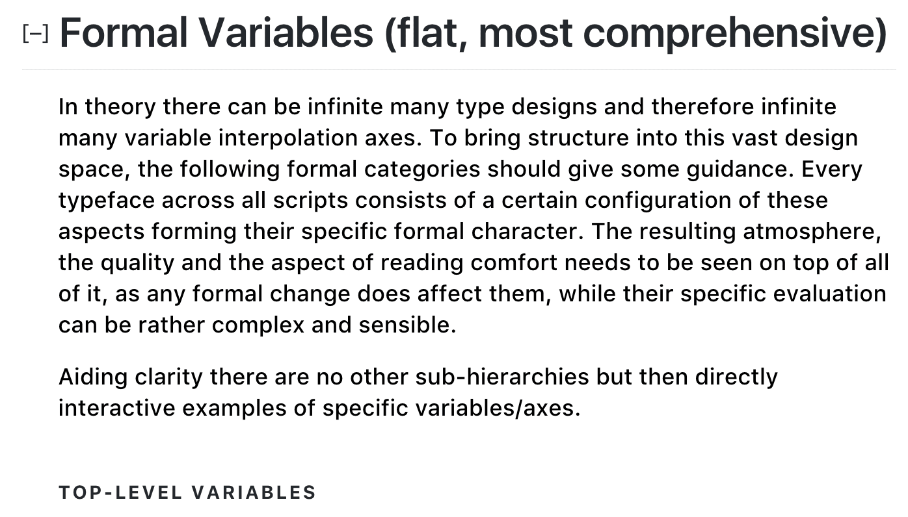
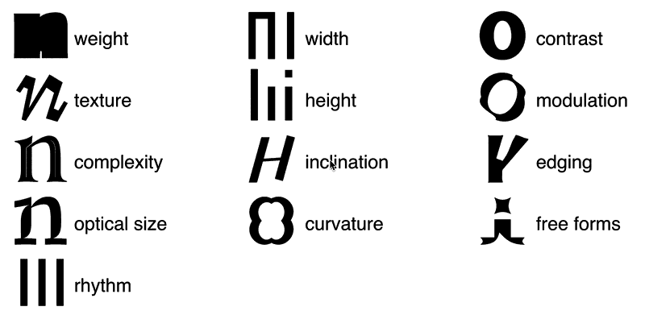

# Type Design Framework
Raw framework for choosing, making or sketching typefaces – I use it to guide personal reflection and discussions while teaching typography and type design. Currently it is not meant to work in isolation. (work in progress)

[Type Design Framework](http://manuel.vongebhardi.de/theory/typedesign-framework/) (external link) 

Preview
-

-

[Backup, Alpha Version](http://manuel.vongebhardi.de/theory/typedesign-framework/alpha.html) (only formal)
